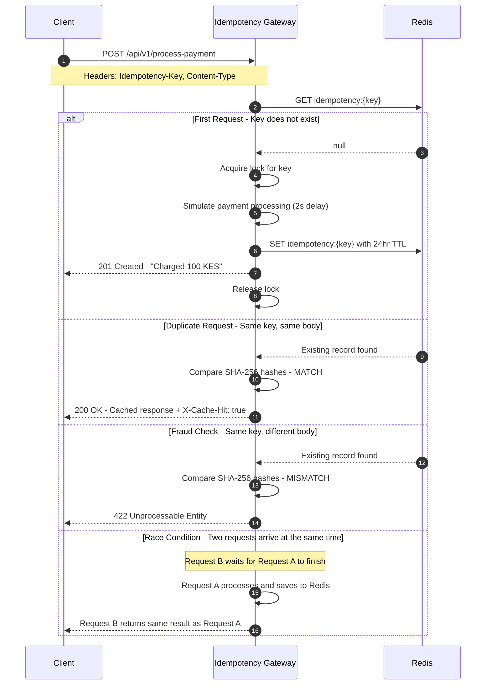

# Idempotency Gateway — FinSafe Transactions Ltd.

A production-grade idempotency layer built with Java and Spring Boot that ensures payment requests are processed **exactly once**, regardless of how many times they are retried.

---

## Architecture Diagram



---

## Setup Instructions

### Prerequisites
- Java 17+
- Maven
- Docker

### 1. Clone the Repository
```bash
git clone https://github.com/EffieMbuthi/AmaliTech-DEG-Project-based-challenges.git
cd AmaliTech-DEG-Project-based-challenges/backend/Idempotency-gateway
```

### 2. Start Redis via Docker
```bash
docker run -d --name redis-idempotency -p 6379:6379 redis
```

### 3. Run the Application
```bash
./mvnw spring-boot:run
```

The server starts on `http://localhost:8080`

### 4. Run Tests
```bash
./mvnw test
```

---

## API Documentation

### Base URL: http://localhost:8080/api/v1

---

### POST /process-payment

Processes a payment request. Uses the `Idempotency-Key` header to ensure the payment is only processed once.

#### Request Headers

| Header | Required | Description |
|---|---|---|
| `Idempotency-Key` | Yes | Unique identifier for this request |
| `Content-Type` | Yes | Must be `application/json` |

#### Request Body

```json
{
    "amount": 100.00,
    "currency": "KES"
}
```

| Field | Type | Validation |
|---|---|---|
| `amount` | BigDecimal | Required, must be greater than 0.01 |
| `currency` | String | Required, must be a 3-letter ISO code e.g. KES, USD, GHS |

---

#### Response Examples

**201 Created — First Request**
```json
{
    "message": "Charged 100.00 KES",
    "status": "SUCCESS",
    "idempotencyKey": "my-unique-key-001",
    "processedAt": "2026-04-27T10:00:00Z"
}
```

**200 OK — Duplicate Request**

Same response body as the first request, plus response header: X-Cache-Hit: true

**422 Unprocessable Entity — Same Key, Different Body**
```json
{
    "timestamp": "2026-04-27T10:00:00Z",
    "status": 422,
    "error": "Unprocessable Entity",
    "message": "Idempotency key already used for a different request body."
}
```

**400 Bad Request — Missing Idempotency-Key Header**
```json
{
    "timestamp": "2026-04-27T10:00:00Z",
    "status": 400,
    "error": "Bad Request",
    "message": "Missing required header: Idempotency-Key"
}
```

**400 Bad Request — Invalid Request Body**
```json
{
    "timestamp": "2026-04-27T10:00:00Z",
    "status": 400,
    "error": "Validation Failed",
    "details": {
        "amount": "Amount is required",
        "currency": "Currency must be a 3-letter ISO code e.g. KES, GHS, USD"
    }
}
```

---

## Design Decisions

### 1. Redis for Idempotency Storage
Redis was chosen over an in-memory Map because it supports TTL expiry natively, performs faster key lookups than a relational database, and would support horizontal scaling in a real production environment.

### 2. SHA-256 Request Body Hashing
The request body is hashed using SHA-256 before storage. This allows efficient comparison of payloads without storing the full request body, and enables detection of fraudulent attempts to reuse a key with a different payload.

### 3. ReentrantLock for Race Condition Handling
A ConcurrentHashMap of ReentrantLocks is used to manage per-key locks. When two identical requests arrive simultaneously, the second request waits for the first to complete and then returns the cached result — preventing double processing without returning an error.

### 4. BigDecimal for Monetary Values
BigDecimal is used instead of double or float for the payment amount. Floating point types cannot accurately represent all decimal values, which is unacceptable in a financial system where precision is critical.

---

## Developer's Choice: Idempotency Key Expiry (TTL)

### What Was Added
Idempotency keys automatically expire after **24 hours** via Redis TTL configuration.

### Why
In a real fintech system, storing idempotency keys forever would cause the Redis store to grow indefinitely, eventually exhausting memory. A 24-hour TTL reflects real-world payment industry standards — payment retries are only valid within a short window. After 24 hours, the same key can be safely reused for a new transaction.

This is configurable via `application.properties`:
```properties
idempotency.key.ttl=86400
```

---

## Project Structure

src/
├── main/java/com/finsafe/idempotency_gateway/
│   ├── config/
│   │   └── RedisConfig.java
│   ├── controller/
│   │   └── PaymentController.java
│   ├── dto/
│   │   ├── ErrorResponse.java
│   │   ├── PaymentRequest.java
│   │   ├── PaymentResponse.java
│   │   └── ValidationErrorResponse.java
│   ├── exception/
│   │   ├── DuplicateRequestException.java
│   │   ├── GlobalExceptionHandler.java
│   │   ├── IdempotencyKeyMissingException.java
│   │   └── PaymentProcessingException.java
│   ├── model/
│   │   └── IdempotencyRecord.java
│   └── service/
│       └── IdempotencyService.java
└── test/java/com/finsafe/idempotency_gateway/
└── service/
└── IdempotencyServiceTest.java


---

## Tech Stack

| Technology | Purpose |
|---|---|
| Java 17 | Primary language |
| Spring Boot | Application framework |
| Spring Data Redis | Redis integration |
| Redis | Idempotency key storage |
| Lombok | Boilerplate reduction |
| Jackson | JSON serialization |
| Docker | Redis containerization |
| JUnit 5 + Mockito | Unit testing |

