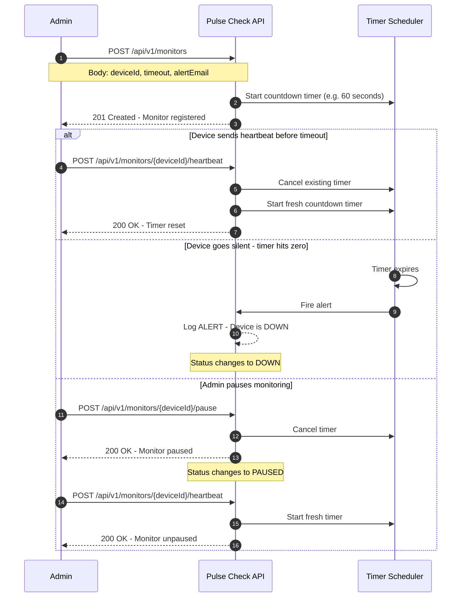

# Pulse Check API: CritMon Servers Inc.

A production-grade Dead Man's Switch API built with Java and Spring Boot that monitors remote devices and fires alerts when they stop sending heartbeats.

---

## Architecture Diagram



---

## Setup Instructions

### Prerequisites
- Java 17+
- Maven

### 1. Clone the Repository
```bash
git clone https://github.com/EffieMbuthi/AmaliTech-DEG-Project-based-challenges.git
cd AmaliTech-DEG-Project-based-challenges/backend/Pulse-Check
```

### 2. Run the Application
```bash
./mvnw spring-boot:run
```

The server starts on `http://localhost:8081`

### 3. Run via Docker
```bash
docker build -t pulse-check .
docker run -p 8081:8081 pulse-check
```

### 4. Run Tests
```bash
./mvnw test
```

---

## API Documentation

### Base URL
http://localhost:8081/api/v1

---

### POST /monitors — Register a Monitor

Registers a new device monitor and starts the countdown timer.

#### Request Body

```json
{
    "deviceId": "solar-farm-001",
    "timeout": 60,
    "alertEmail": "admin@critmon.com"
}
```

| Field | Type | Validation |
|---|---|---|
| `deviceId` | String | Required, must not be blank |
| `timeout` | Integer | Required, must be at least 1 second |
| `alertEmail` | String | Required, must be a valid email address |

#### Response: 201 Created

```json
{
    "id": "4dc4ad7a-d2e6-4bf2-b9a9-373948330d71",
    "deviceId": "solar-farm-001",
    "timeout": 60,
    "alertEmail": "admin@critmon.com",
    "status": "ACTIVE",
    "createdAt": "2026-04-27T10:00:00Z",
    "lastHeartbeat": "2026-04-27T10:00:00Z"
}
```

---

### POST /monitors/{deviceId}/heartbeat: Send Heartbeat

Resets the countdown timer for a device. If the monitor was paused, it automatically unpauses.

#### Response: 200 OK

```json
{
    "id": "4dc4ad7a-d2e6-4bf2-b9a9-373948330d71",
    "deviceId": "solar-farm-001",
    "timeout": 60,
    "alertEmail": "admin@critmon.com",
    "status": "ACTIVE",
    "createdAt": "2026-04-27T10:00:00Z",
    "lastHeartbeat": "2026-04-27T10:01:00Z"
}
```

---

### POST /monitors/{deviceId}/pause: Pause a Monitor

Stops the countdown timer completely. No alerts will fire while paused.

#### Response: 200 OK

```json
{
    "id": "4dc4ad7a-d2e6-4bf2-b9a9-373948330d71",
    "deviceId": "solar-farm-001",
    "timeout": 60,
    "alertEmail": "admin@critmon.com",
    "status": "PAUSED",
    "createdAt": "2026-04-27T10:00:00Z",
    "lastHeartbeat": "2026-04-27T10:00:00Z"
}
```

---

### GET /monitors/{deviceId}: Get Monitor Details

Returns the current state of a monitor.

#### Response: 200 OK

```json
{
    "id": "4dc4ad7a-d2e6-4bf2-b9a9-373948330d71",
    "deviceId": "solar-farm-001",
    "timeout": 60,
    "alertEmail": "admin@critmon.com",
    "status": "DOWN",
    "createdAt": "2026-04-27T10:00:00Z",
    "lastHeartbeat": "2026-04-27T10:00:00Z"
}
```

---

### Error Responses

**404 Not Found: Device not registered**
```json
{
    "timestamp": "2026-04-28T00:03:19.985035200Z",
    "status": 404,
    "error": "Not Found",
    "message": "Monitor not found for device: solar-farm-001"
}
```

**409 Conflict — Device already registered**
```json
{
    "timestamp": "2026-04-28T00:07:23.203644400Z",
    "status": 409,
    "error": "Conflict",
    "message": "Monitor already exists for device: solar-farm-001"
}
```

**400 Bad Request — Validation Error**
```json
{
    "timestamp": "2026-04-27T23:56:02.225348700Z",
    "status": 400,
    "error": "Validation Failed",
    "details": {
        "deviceId": "Device ID is required",
        "timeout": "Timeout must be at least 1 second",
        "alertEmail": "Alert email must be a valid email address"
    }
}
```

---

## Alert Format

When a device timer expires the system logs the following to the console:

```json
{"ALERT": "Device solar-farm-001 is down!", "time": "2026-04-27T23:59:57.487552900Z"}
```

---

## Design Decisions

### 1. In-Memory Storage with ConcurrentHashMap
Since device monitors are temporary and stateful timers cannot be easily persisted, a `ConcurrentHashMap` was chosen for storage. It is thread-safe and provides O(1) lookup time, critical for a system that may handle many concurrent heartbeats.

### 2. ScheduledExecutorService for Timers
Java's `ScheduledExecutorService` was chosen to manage per-device countdown timers. It supports scheduling tasks with precise delays, cancelling timers on heartbeat, and running multiple timers concurrently without blocking.

### 3. UUID for Monitor IDs
Each monitor is assigned a server-generated UUID instead of relying on the client-provided `deviceId`. This provides a globally unique, unguessable identifier that separates the internal system ID from the human-readable device name.

### 4. Separate `deviceId` and `id` Fields
The model has both a UUID `id` (system generated) and a `deviceId` (human readable, client provided). This mirrors real-world systems where clients use friendly names but the system uses secure identifiers internally.

---

## Developer's Choice: Monitor Status History

### What Was Added
Each monitor tracks its full lifecycle through the `MonitorStatus` enum with three states: `ACTIVE`, `PAUSED`, and `DOWN`.

### Why
In a real infrastructure monitoring system, knowing the **current status** of a device is not enough. Support engineers need to know:
- Is the device actively being monitored?
- Was it intentionally paused for maintenance?
- Has it gone offline unexpectedly?

The status field gives operators instant visibility into the state of every device without having to check logs manually.

---

## Project Structure
```
src/
├── main/java/com/pulsecheck/pulse_check/
│   ├── controller/
│   │   └── MonitorController.java
│   ├── dto/
│   │   ├── ErrorResponse.java
│   │   ├── MonitorRequest.java
│   │   ├── MonitorResponse.java
│   │   └── ValidationErrorResponse.java
│   ├── exception/
│   │   ├── GlobalExceptionHandler.java
│   │   ├── MonitorAlreadyExistsException.java
│   │   └── MonitorNotFoundException.java
│   ├── model/
│   │   ├── Monitor.java
│   │   └── MonitorStatus.java
│   └── service/
│       └── MonitorService.java
└── test/java/com/pulsecheck/pulse_check/
└── service/
└── MonitorServiceTest.java
```

---

## Tech Stack

| Technology | Purpose |
|---|---|
| Java 17 | Primary language |
| Spring Boot | Application framework |
| ScheduledExecutorService | Timer management |
| ConcurrentHashMap | Thread-safe in-memory storage |
| Lombok | Boilerplate reduction |
| Docker | Containerization |
| JUnit 5 + Mockito | Unit testing |